# CarValue ML Project Report

## Contents

1. [Abstract](#1-abstract)
2. [Objectives](#2-objectives)
3. [Dataset](#3-dataset)
4. [Methodology](#4-methodology)
5. [Application Flow](#5-application-flow)
6. [Evaluation](#6-evaluation)
7. [Exploratory Charts](#7-exploratory-charts)
8. [Input Behavior](#8-input-behavior)
9. [Limitations](#9-limitations)
10. [Future Improvements](#10-future-improvements)
11. [Conclusion](#11-conclusion)

## 1. Abstract

CarValue ML is a supervised machine learning mini-project that estimates a
vehicle's price in USD from ten structured attributes. It demonstrates data
inspection, mixed-type preprocessing, regression, hyperparameter search,
evaluation, visualization, model serialization, and simple browser and CLI
interfaces.

The included dataset has 6,000 complete and unique rows. On the fixed 20%
validation split, the generated evaluation chart reports a rounded $R^2$ of
0.82. This result is evidence for the included split only.

## 2. Objectives

1. Prepare numeric and categorical vehicle data for regression.
2. Train and tune a Random Forest model reproducibly.
3. Evaluate predictions on a held-out validation split.
4. Present model behavior through clear charts.
5. Make the saved model usable from a browser and command line.

## 3. Dataset

`car_price_dataset_usd.csv` contains 6,000 rows, ten input columns, and one
target column.

| Column | Role | Observed values or range |
|---|---|---|
| `company_name` | Categorical input | 20 manufacturers |
| `model` | Categorical input | 62 models |
| `year` | Numeric input | 1985 to 2024 in the CSV |
| `km_driven` | Numeric input | 0 to 249,824 km |
| `fuel_type` | Categorical input | Diesel, Electric, Hybrid, Petrol |
| `transmission` | Categorical input | Automatic, Manual |
| `engine_cc` | Numeric input | 800 to 5,000 cc |
| `max_power_bhp` | Numeric input | 60 to 700 bhp |
| `condition` | Categorical input | Brand New, Second Hand |
| `mileage_kmpl` | Numeric input | 8 to 35 km/l |
| `price_usd` | Regression target | $2,000 to $446,033.69 |

The current CSV contains no missing values and no exact duplicate rows. The
training code still drops a row if any required input or target is missing, so
the workflow remains valid if the dataset is later updated.

### Schema

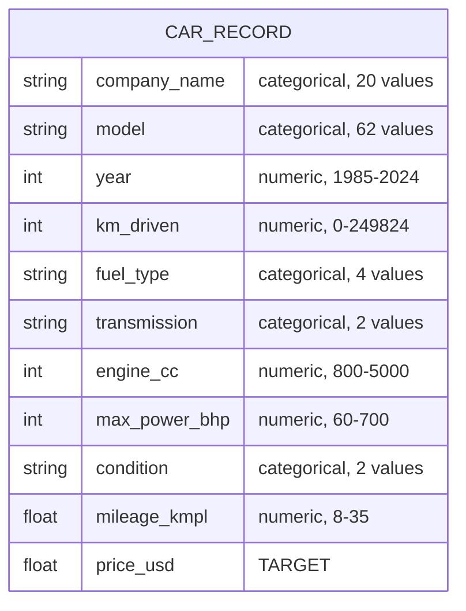
```mermaid
erDiagram
    CAR_RECORD {
        string company_name "categorical, 20 values"
        string model "categorical, 62 values"
        int year "numeric, 1985-2024"
        int km_driven "numeric, 0-249824"
        string fuel_type "categorical, 4 values"
        string transmission "categorical, 2 values"
        int engine_cc "numeric, 800-5000"
        int max_power_bhp "numeric, 60-700"
        string condition "categorical, 2 values"
        float mileage_kmpl "numeric, 8-35"
        float price_usd "TARGET"
    }
```

Five categorical and five numeric columns are used as inputs, and `price_usd`
is the regression target.

### Category Balance

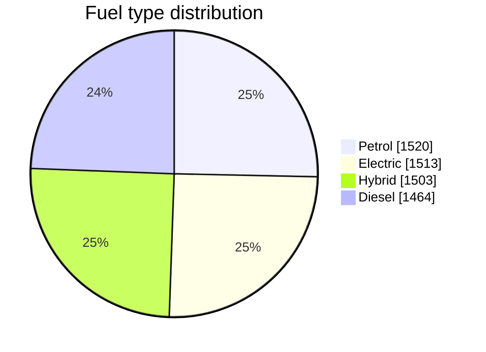
```mermaid
pie showData
    title Fuel type distribution
    "Petrol" : 1520
    "Electric" : 1513
    "Hybrid" : 1503
    "Diesel" : 1464
```

Condition is split exactly evenly at 3,000 brand-new and 3,000 second-hand
records. Transmission is close to even with 3,008 manual and 2,992 automatic
records. This balance means the model is not favouring a category merely
because that category appears more often.

### Dataset Limitation

The supplied files do not identify the original dataset source, collection
method, date, geography, or independent license. Therefore, the dataset should
be described as an educational project artifact. It should not be presented as
authoritative current market data without locating and citing its source.

## 4. Methodology

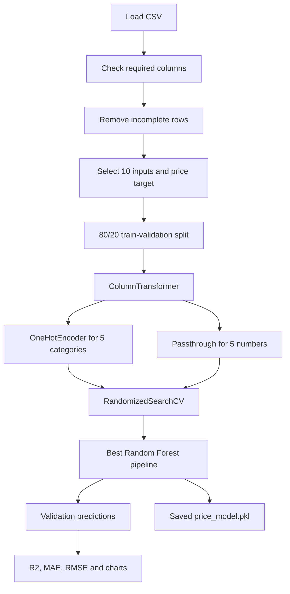
```mermaid
flowchart TD
    A[Load CSV] --> B[Check required columns]
    B --> C[Remove incomplete rows]
    C --> D[Select 10 inputs and price target]
    D --> E[80/20 train-validation split]
    E --> F[ColumnTransformer]
    F --> G[OneHotEncoder for 5 categories]
    F --> H[Passthrough for 5 numbers]
    G --> I[RandomizedSearchCV]
    H --> I
    I --> J[Best Random Forest pipeline]
    J --> K[Validation predictions]
    J --> L[Saved price_model.pkl]
    K --> M[R2, MAE, RMSE and charts]
```

### Preprocessing

Five categorical features are transformed with `OneHotEncoder`. The encoder
uses `handle_unknown="ignore"`, allowing the model pipeline to process an
unseen category without crashing. Five numeric features pass through unchanged.
Both transformations are stored inside a `ColumnTransformer`.

### Training

The dataset is split into 80% training data and 20% validation data with
`random_state=42`. `RandomizedSearchCV` searches combinations of:

- number of trees;
- maximum tree depth;
- minimum samples needed to split;
- minimum samples per leaf;
- number of sampled features;
- bootstrap sampling.

The default training command evaluates 25 combinations using three-fold
cross-validation and $R^2$ scoring. The best complete pipeline is compressed
with joblib and saved as `price_model.pkl`.

## 5. Application Flow

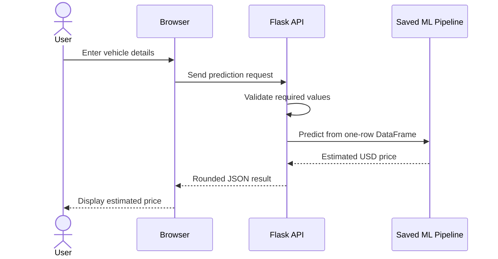
```mermaid
sequenceDiagram
    actor User
    participant UI as Browser
    participant API as Flask API
    participant Model as Saved ML Pipeline

    User->>UI: Enter vehicle details
    UI->>API: Send prediction request
    API->>API: Validate required values
    API->>Model: Predict from one-row DataFrame
    Model-->>API: Estimated USD price
    API-->>UI: Rounded JSON result
    UI-->>User: Display estimated price
```

The browser can be served by Flask at `http://127.0.0.1:5000` or opened from
`index.html`. In both cases, `app.py` must be running because prediction is
performed by the Flask API and saved model. The separate `user_ip.py` CLI
loads the same saved pipeline directly, validates terminal input, and prints
the predicted price without calling Flask.

### Module Responsibilities

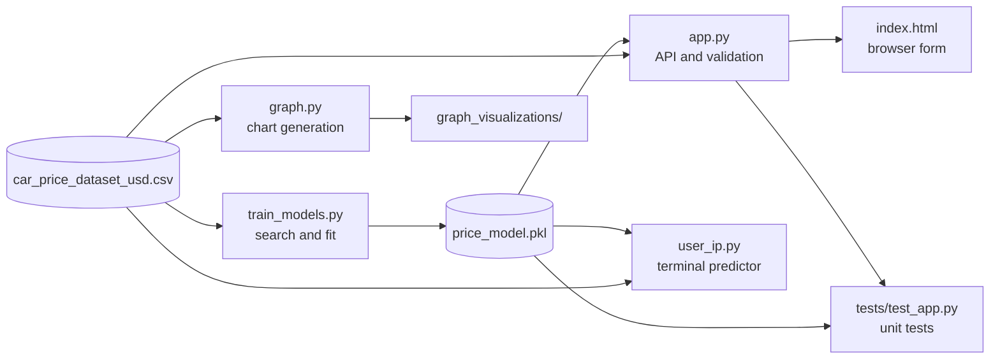
```mermaid
flowchart LR
    D[("car_price_dataset_usd.csv")]
    T["train_models.py<br/>search and fit"]
    M[("price_model.pkl")]
    V["graph.py<br/>chart generation"]
    G["graph_visualizations/"]
    A["app.py<br/>API and validation"]
    H["index.html<br/>browser form"]
    C["user_ip.py<br/>terminal predictor"]
    S["tests/test_app.py<br/>unit tests"]

    D --> T --> M
    D --> V --> G
    M --> A
    D --> A
    A --> H
    M --> C
    D --> C
    A --> S
    M --> S
```

Each file has one clear responsibility, which keeps training, serving, and
visualization independent of one another.

## 6. Evaluation

The current actual-versus-predicted chart reports validation $R^2=0.82$ after
rounding. $R^2$ measures the proportion of target variance explained on this
split; it does not measure dollar error and does not guarantee future-market
performance.

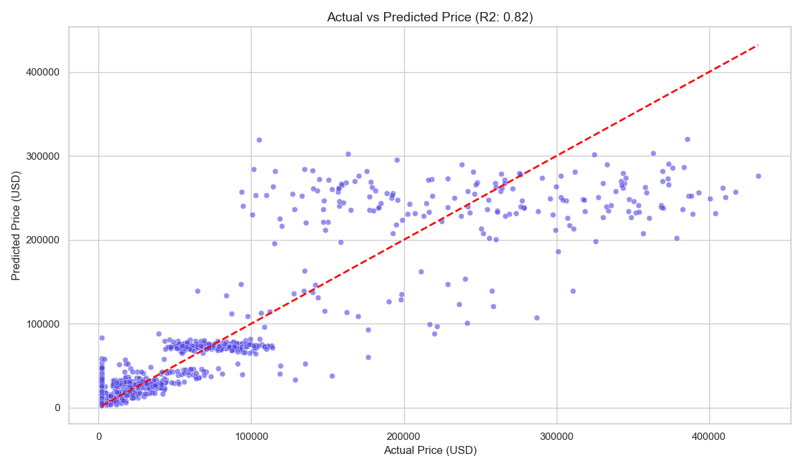

The residual distribution shows prediction error around zero and helps reveal
spread and possible bias. The scatter plot also suggests that some high-price
vehicles have larger errors than typical vehicles.

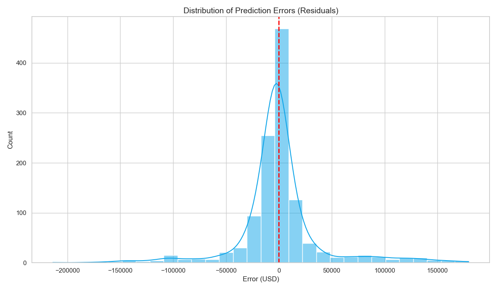

Feature importance is impurity-based. It describes this fitted Random Forest,
not a causal relationship between an attribute and price.

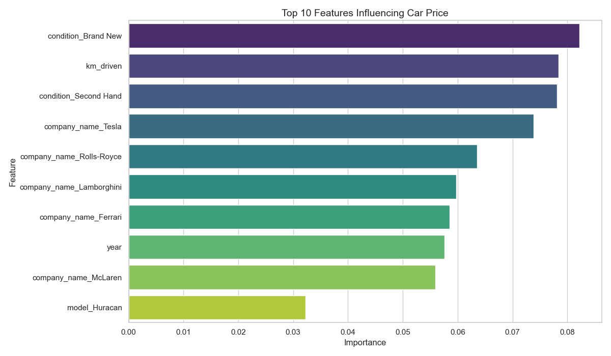

## 7. Exploratory Charts

### Numeric Correlation

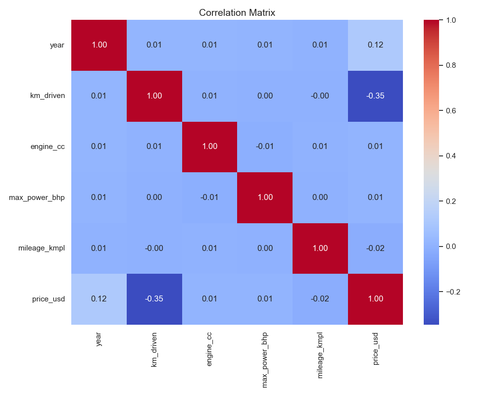

### Average Price by Manufacturer

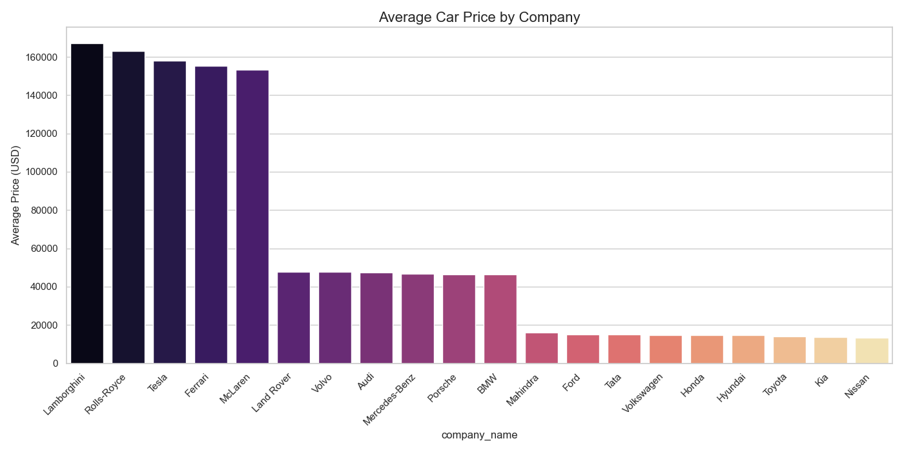

### Price and Manufacture Year

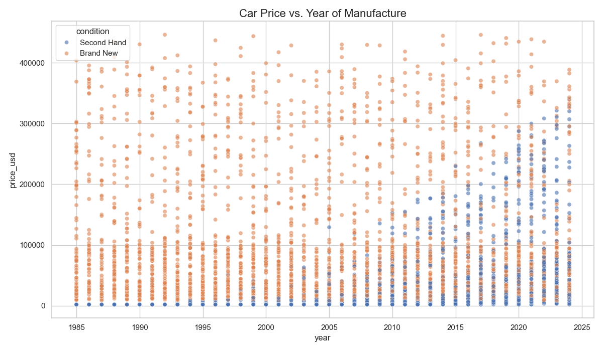

### Brand-New Car Mileage

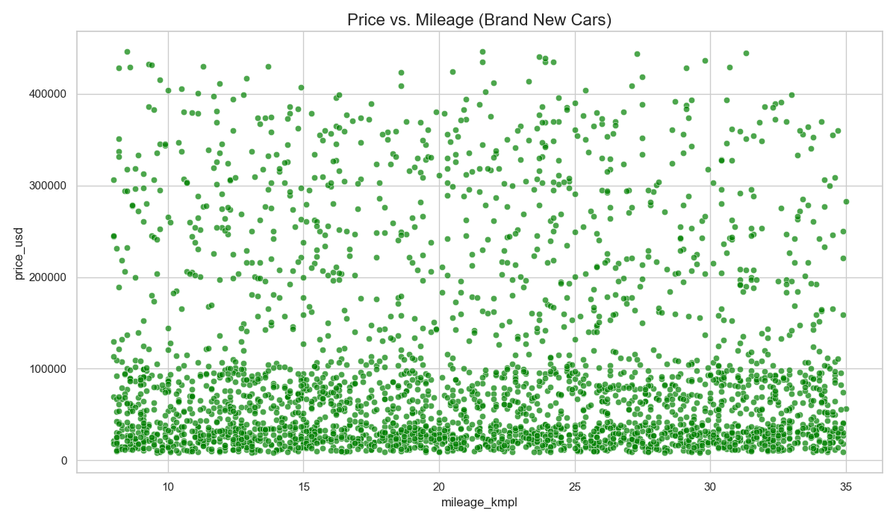

### Second-Hand Car Usage

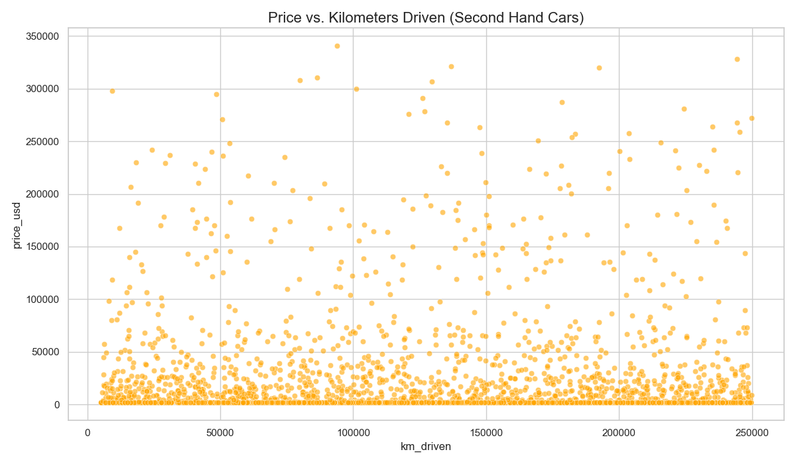

### Target Distribution

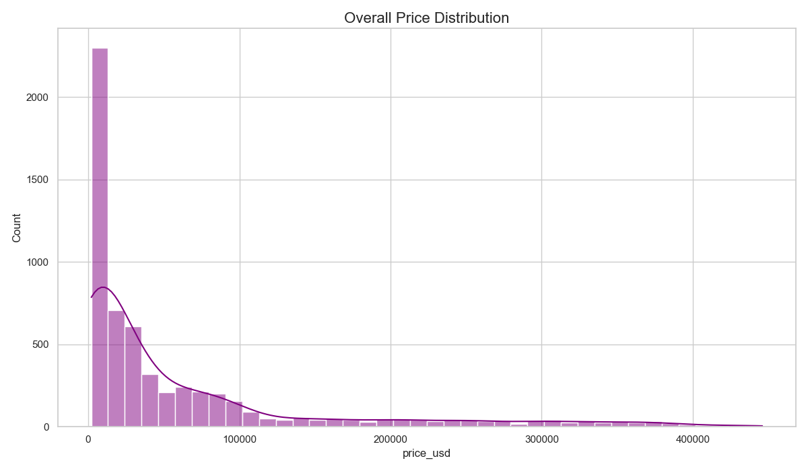

### Price by Fuel Type

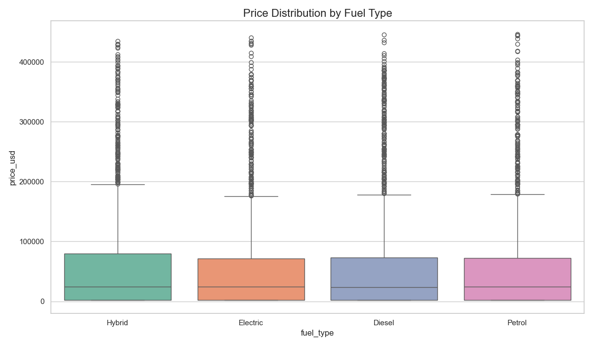

Average price varies only slightly across fuel types:

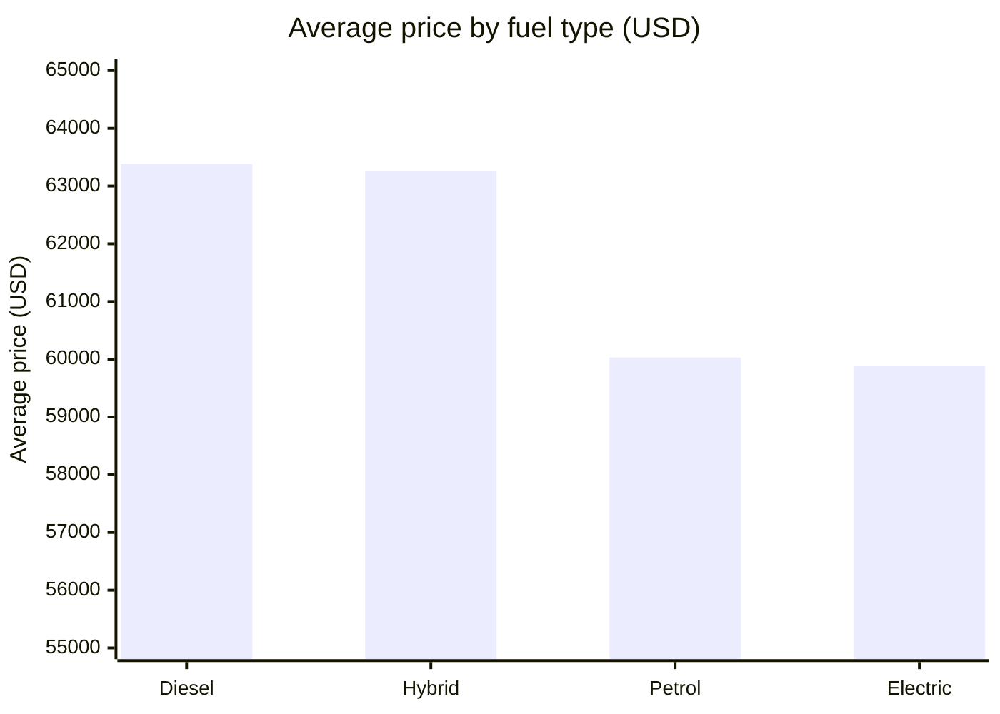
```mermaid
xychart-beta
    title "Average price by fuel type (USD)"
    x-axis ["Diesel", "Hybrid", "Petrol", "Electric"]
    y-axis "Average price (USD)" 55000 --> 65000
    bar [63383, 63257, 60030, 59890]
```

The spread between the highest and lowest fuel type is about $3,493. By
contrast, the gap between brand-new and second-hand cars is about $78,795, so
condition is a far stronger price signal than fuel type in this dataset.

## 8. Input Behavior

The web API retains the original project rules:

- years from 1980 through 2025 are accepted;
- kilometers driven is required only for a second-hand car;
- brand-new cars are predicted with zero kilometers driven;
- engine capacity must be at least 600 cc;
- maximum power must be at least 30 bhp;
- mileage must be at least 3 km/l;
- all five categorical and five numeric inputs are preserved.

### Request Validation States

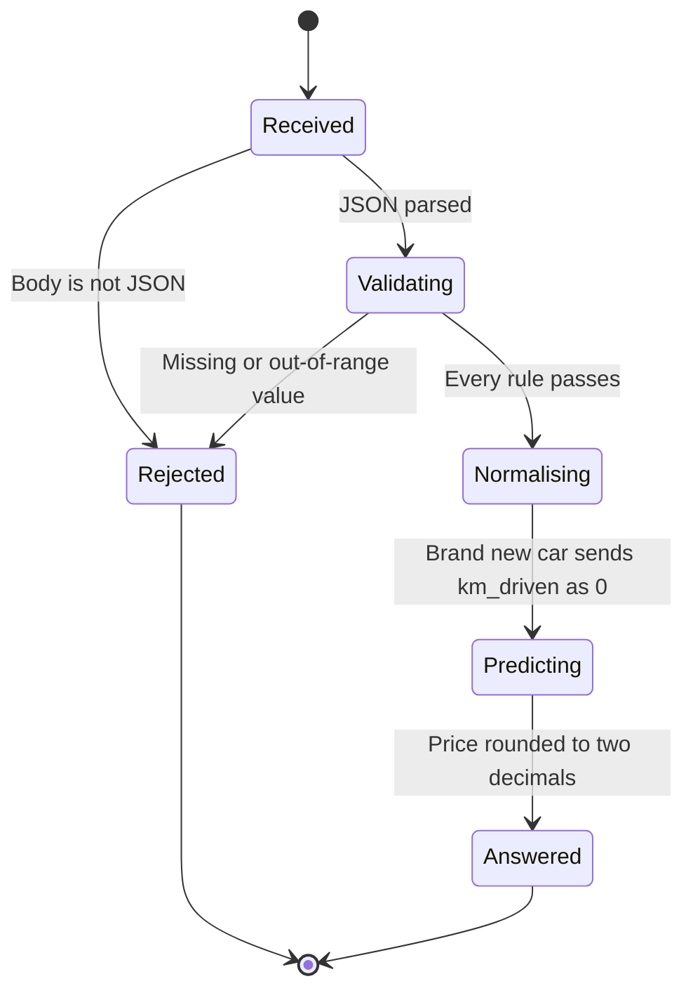
```mermaid
stateDiagram-v2
    [*] --> Received
    Received --> Rejected: Body is not JSON
    Received --> Validating: JSON parsed
    Validating --> Rejected: Missing or out-of-range value
    Validating --> Normalising: Every rule passes
    Normalising --> Predicting: Brand new car sends km_driven as 0
    Predicting --> Answered: Price rounded to two decimals
    Rejected --> [*]
    Answered --> [*]
```

A rejected request returns the collected error messages instead of a price, so
the interface can show every problem at once.

Dropdown values come from the CSV, but the saved encoder remains responsible
for transforming categories. The API returns the model's prediction rounded to
two decimal places without modifying its value.

## 9. Limitations

- Dataset provenance and usage rights are not documented.
- The random split does not test performance on future market periods.
- Geography, sale date, trim, accident history, service history, ownership,
  and local demand are absent.
- The model provides a point estimate without a confidence interval.
- The evaluation has not been repeated on an independent external dataset.
- Market prices can change over time, making retraining necessary.

## 10. Future Improvements

1. Locate and cite an authoritative dataset source.
2. Add a simple baseline and a gradient-boosting comparison.
3. Evaluate on chronological and independent test sets.
4. Compare MAE by price range, manufacturer, and vehicle condition.
5. Add uncertainty estimates after validating the underlying data.

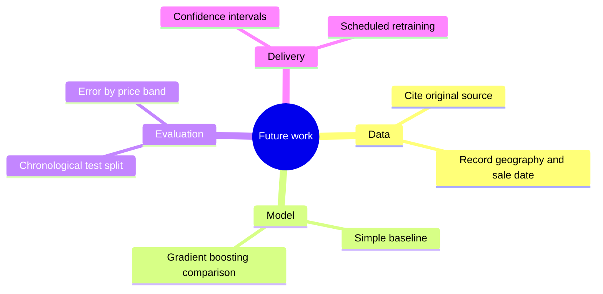
```mermaid
mindmap
  root((Future work))
    Data
      Cite original source
      Record geography and sale date
    Model
      Simple baseline
      Gradient boosting comparison
    Evaluation
      Chronological test split
      Error by price band
    Delivery
      Confidence intervals
      Scheduled retraining
```

## 11. Conclusion

CarValue ML demonstrates a complete college-level regression workflow without
hiding preprocessing outside the saved model. Its strongest parts are the
reproducible pipeline, clear visual evaluation, and two usable prediction
interfaces. The documented data limitations are important when presenting the
project in interviews or considering future development.