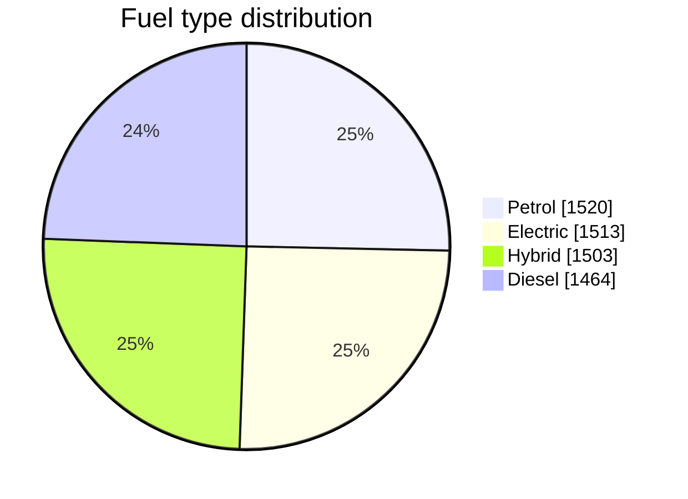
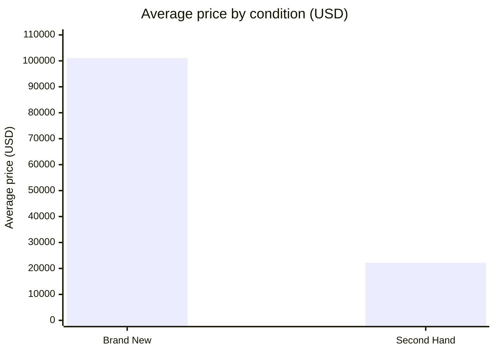
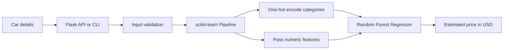
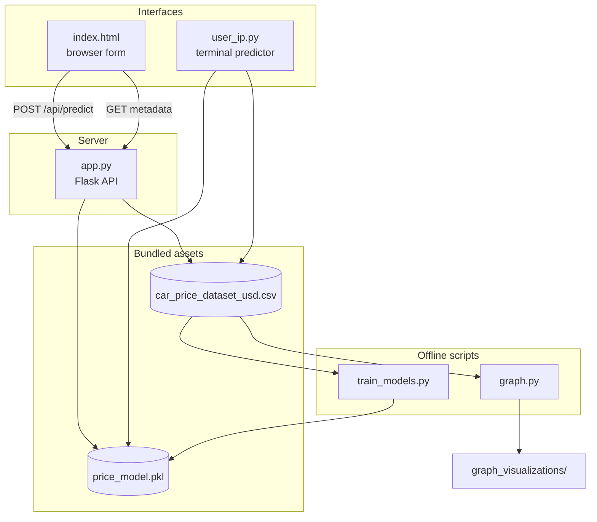

# CarValue ML

A college machine learning mini-project that predicts a car's estimated price
in USD from its manufacturer, model, manufacture year, condition, usage, fuel type,
transmission, engine, power, and mileage.


## Highlights

- End-to-end regression workflow using a tuned Random Forest
- Five numeric and five categorical input features
- One-hot encoding and prediction combined in one scikit-learn pipeline
- Responsive browser interface and interactive command-line interface
- Input validation for brand-new and second-hand cars
- Ten generated evaluation and exploratory data analysis charts
- Reproducible training with a fixed random state
- Runs offline: no CDN, no external service, and no downloaded asset

## Verified Project Snapshot

| Item | Value |
|---|---:|
| Dataset size | 6,000 rows and 11 columns |
| Missing values | 0 |
| Exact duplicate rows | 0 |
| Manufacturers | 20 |
| Car models | 62 |
| Input features | 10 |
| Target | `price_usd` |
| Algorithm | Random Forest Regressor |
| Validation split | 20% with `random_state=42` |
| Validation $R^2$ | 0.82, rounded in the generated chart |

The validation score describes this included dataset and split only. It is not
evidence that the model has the same accuracy on current real-world listings.

## Dataset at a Glance

The four fuel types are almost evenly represented, so no single category
dominates training.



Condition is the strongest single price signal in the data. Brand-new and
second-hand cars are split exactly 3,000 and 3,000, but their average prices
are far apart:



## Model Performance


Each point is one test car, with its real price on the horizontal axis and the
predicted price on the vertical axis. The dashed line marks a perfect
prediction. Points track that line closely below roughly $120,000, but above
that range the predictions flatten and sit under the line, so the most
expensive cars are valued too low. That gap is the main weakness behind the
0.82 validation score.

## How It Works



The saved model contains both preprocessing and the fitted estimator. The web
page reads available manufacturers, models, fuel types, and transmissions from
the CSV through the Flask metadata endpoint.

### System Components



## Project Structure

```text
.
|-- graph_visualizations/          # Evaluation and EDA charts
|-- tests/test_app.py              # API and packaged-model checks
|-- app.py                         # Flask API and web server
|-- car_price_dataset_usd.csv      # Dataset used by the project
|-- graph.py                       # Chart generation
|-- index.html                     # Browser interface
|-- price_model.pkl                # Compressed trained pipeline
|-- train_models.py                # Training and evaluation
|-- user_ip.py                     # Interactive CLI predictor
|-- PROJECT_REPORT.md              # Methodology, diagrams, and results
|-- REPORT_Car price prediction.pdf
`-- requirements.txt
```

Everything the project needs at run time is inside this folder: the dataset,
the trained model, the charts, and the web page. The only external requirement
is the Python packages listed in `requirements.txt`. Training is optional,
because `price_model.pkl` is already included.

## Setup

Python 3.12 is recommended.

```bash
python -m venv .venv
```

Windows PowerShell:

```powershell
.\.venv\Scripts\Activate.ps1
python -m pip install -r requirements.txt
```

macOS or Linux:

```bash
source .venv/bin/activate
python -m pip install -r requirements.txt
```

`scikit-learn` is pinned to the version that created the included
`price_model.pkl`, so the saved pipeline loads without a version warning.
Retraining with a newer version also works; update the pin if you do that.

## Run the Web App

Start the Flask server:

```bash
python app.py
```

Then choose either launch method:

1. Open <http://127.0.0.1:5000> to let Flask serve the interface.
2. Open `index.html` directly in a browser while the Flask server is running.

Both methods use the same prediction API. Opening `index.html` directly does
not remove the need to run `app.py`; Flask still loads the model and calculates
the prediction.

## Run the CLI

```bash
python user_ip.py
```

The CLI reads valid choices from the dataset, asks for each car attribute, and
prints the estimated USD price.

## Run the Tests

The regression suite uses Python's built-in `unittest` module, so it does not
need a separate test package:

```bash
python -m unittest discover -s tests -v
```

## Train the Model

Run the default 25-combination randomized search:

```bash
python train_models.py
```

For a quicker experiment:

```bash
python train_models.py --n-iter 5 --cv 3
```

Training overwrites `price_model.pkl` and creates `model_metrics.json` with the
new run's exact $R^2$, MAE, RMSE, best parameters, and dataset hash.

## Regenerate Charts

Train the model first, then run:

```bash
python graph.py
```

The script recreates all ten PNG files in `graph_visualizations/`.

## Prediction Inputs

| Feature | Web API rule |
|---|---|
| Manufacturer and model | Required text values |
| Year | 1980 to 2025 |
| Condition | Brand New or Second Hand |
| Kilometers driven | Required and non-negative for second-hand cars |
| Fuel type and transmission | Required |
| Engine capacity | At least 600 cc |
| Maximum power | At least 30 bhp |
| Mileage | At least 3 km/l |

For a brand-new car, kilometers driven is sent to the model as zero. Category
values shown by the interface come from the included dataset.

## Model Evidence

| Residual distribution | Feature importance |
|---|---|
|  |  |

| Average price by manufacturer | Price distribution |
|---|---|
|  |  |

All ten generated charts are discussed in the project report.

## Results and Documentation

See [PROJECT_REPORT.md](PROJECT_REPORT.md) for the dataset summary, training
workflow, diagrams, evaluation discussion, all ten charts, and project
limitations.

## Important Limitation

The original source, collection date, geography, and independent license of the
included CSV are not recorded in the supplied project files. Treat the dataset
and predictions as educational artifacts, not verified market valuations. Add
the original dataset citation before claiming ownership or broader usage rights.

