# Fuel Efficiency Prediction Project Report

## Contents

1. [Abstract](#1-abstract)
2. [Objectives](#2-objectives)
3. [Dataset](#3-dataset)
4. [Methodology](#4-methodology)
5. [Evaluation](#5-evaluation)
6. [Feature Importance](#6-feature-importance)
7. [Visual Evidence](#7-visual-evidence)
8. [Program Workflows](#8-program-workflows)
9. [Verified Limitation in Single-Row Encoding](#9-verified-limitation-in-single-row-encoding)
10. [Other Limitations](#10-other-limitations)
11. [Future Improvements](#11-future-improvements)
12. [Conclusion](#12-conclusion)

## 1. Abstract

This project applies Random Forest regression to estimate vehicle fuel efficiency in kilometres per litre. The supplied dataset contains 3,000 records, eight input features, and one target column. The implementation covers data loading, categorical encoding, an 80/20 train-test split, model evaluation, model serialization, terminal-based prediction, and visualization. With the fixed split used by the scripts, the model achieves a mean absolute error of 0.851 km/l and an R2 score of 0.753.

## 2. Objectives

- Train a regression model for vehicle fuel-efficiency prediction.
- Combine categorical vehicle information with numeric specifications.
- Evaluate predictions on data excluded from training.
- Save the fitted estimator for later use.
- Provide a simple terminal workflow for user-entered vehicle details.
- Visualize prediction quality, feature importance, and the engine-efficiency relationship.

## 3. Dataset

The file `fuel_efficiency_dataset.csv` has 3,000 rows and 9 columns. Verification found no missing cells and no exact duplicate rows.

| Column | Role | Verified values |
|---|---|---|
| `brand` | Input | 10 unique brands |
| `model` | Input | 41 unique models |
| `engine_cc` | Input | 1,000-2,500 cc; mean 1,734.267 |
| `max_power_bhp` | Input | 55.3-237.5 bhp; mean 130.428 |
| `kerb_weight_kg` | Input | 850-1,899 kg; mean 1,373.289 |
| `fuel_type` | Input | Diesel, Petrol |
| `transmission` | Input | Automatic, Manual |
| `kilometers_driven` | Input | 508-199,976 km; mean 99,511.177 |
| `fuel_efficiency_kmpl` | Target | 15.9-27.4 km/l; mean 21.509 |

### Schema

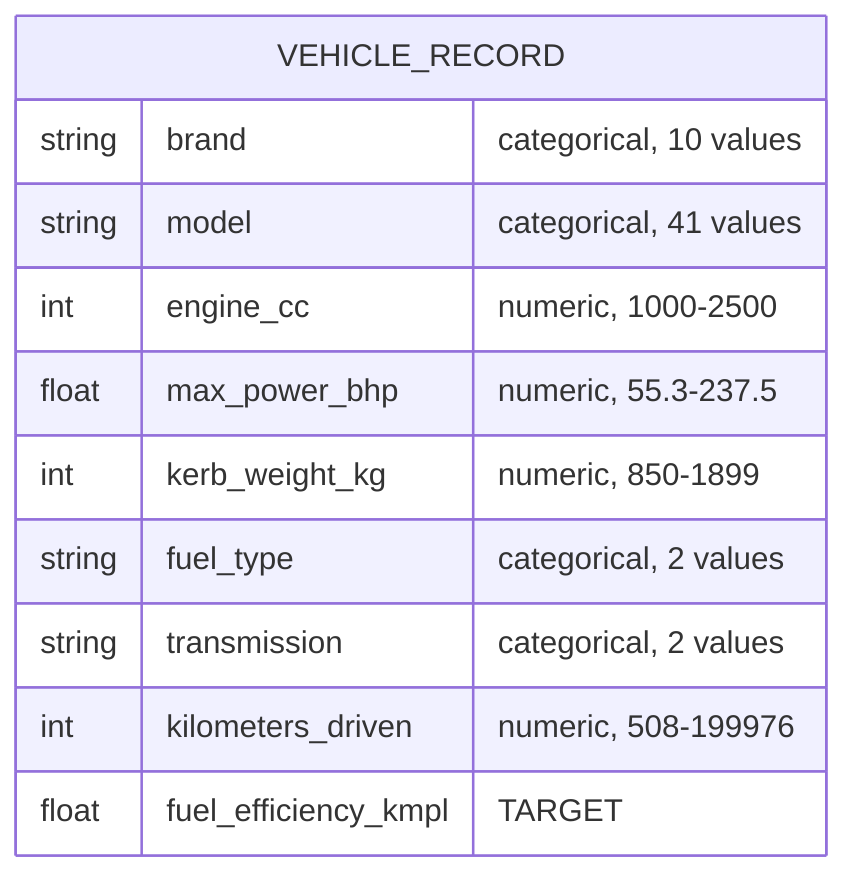

### Category Balance

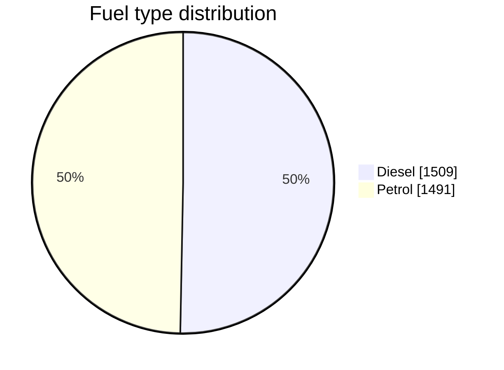

Transmission is split 1,512 automatic and 1,488 manual. Brand counts range from
267 for Nissan to 338 for both Ford and Maruti Suzuki. Because no category is
rare, the encoded features are well represented during training.

### Observed Relationships

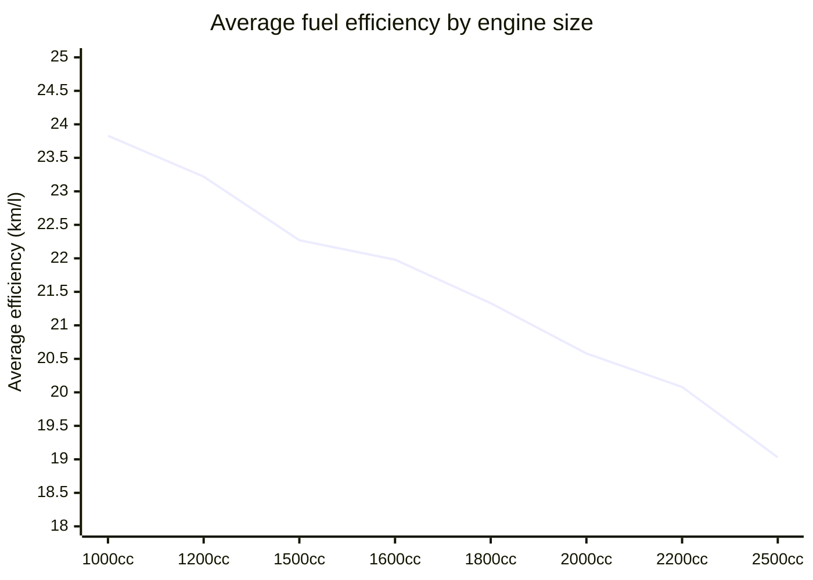

Average efficiency declines consistently as displacement rises. Diesel records
average 22.37 km/l against 20.64 km/l for petrol, and manual records average
22.07 km/l against 20.96 km/l for automatic. These directions match the feature
importance values reported in section 6.

The repository does not provide the dataset's original source, sampling method, or data dictionary. Its suitability beyond this academic exercise therefore cannot be established.

## 4. Methodology

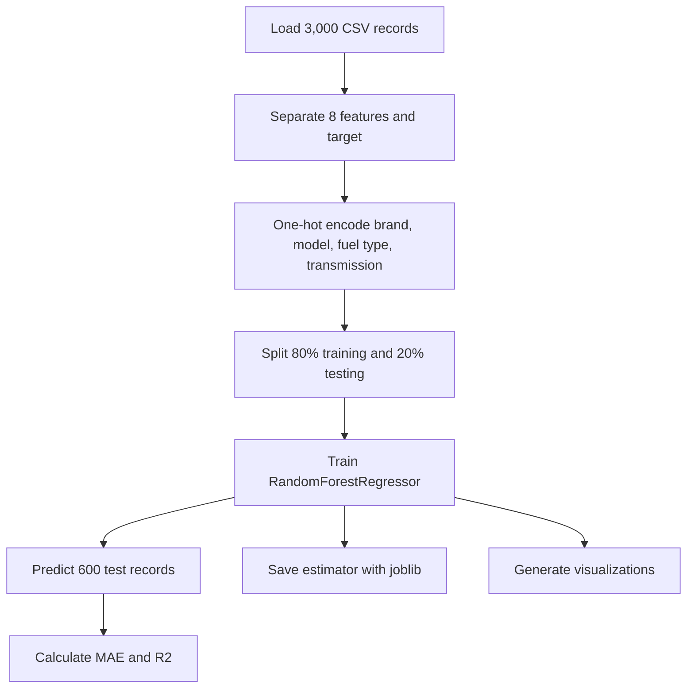

### 4.1 Preprocessing

The scripts use `pandas.get_dummies` with `drop_first=True` for `brand`, `model`, `fuel_type`, and `transmission`. Numeric columns are passed to the estimator without scaling. Scaling is not required for tree-based models.

### 4.2 Data Split

`train_test_split` uses:

- Training portion: 80%, or 2,400 records
- Testing portion: 20%, or 600 records
- Random state: 42

No explicit stratification or cross-validation is applied.

### 4.3 Model

The estimator is `RandomForestRegressor` with:

- `n_estimators=200`
- `max_depth=None`
- `random_state=42`
- `n_jobs=-1`

The saved `efficiency_model.pkl` contains 200 fitted decision trees and was serialized with scikit-learn 1.7.1.

## 5. Evaluation

| Metric | Verified value |
|---|---:|
| Mean Absolute Error | 0.851 km/l |
| R2 score | 0.753 |

The MAE indicates an average absolute test error of approximately 0.85 km/l. The R2 score indicates that the model explains approximately 75.3% of fuel-efficiency variation in this one held-out split. These results describe the supplied dataset and should not be generalized to unrelated real-world vehicles without external validation.

## 6. Feature Importance

The six highest impurity-based importance values are:

| Encoded feature | Importance |
|---|---:|
| `engine_cc` | 0.5435 |
| `fuel_type_Petrol` | 0.1899 |
| `transmission_Manual` | 0.0622 |
| `kerb_weight_kg` | 0.0437 |
| `kilometers_driven` | 0.0434 |
| `max_power_bhp` | 0.0433 |

These six features hold about 92.6% of the total importance. The remaining
7.4% is spread across every brand and model dummy column.

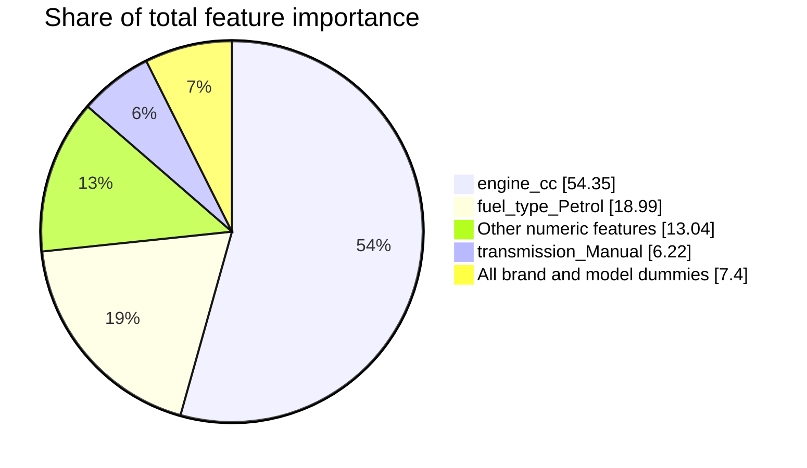

Engine displacement is the largest model input by this measure. Importance values report how the fitted forest used its features; they do not prove causal effects.

## 7. Visual Evidence

### 7.1 Actual vs Predicted

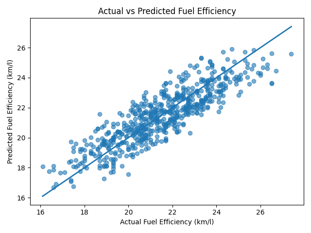

The points generally follow the diagonal reference line, while visible spread represents prediction error.

### 7.2 Engine CC vs Fuel Efficiency

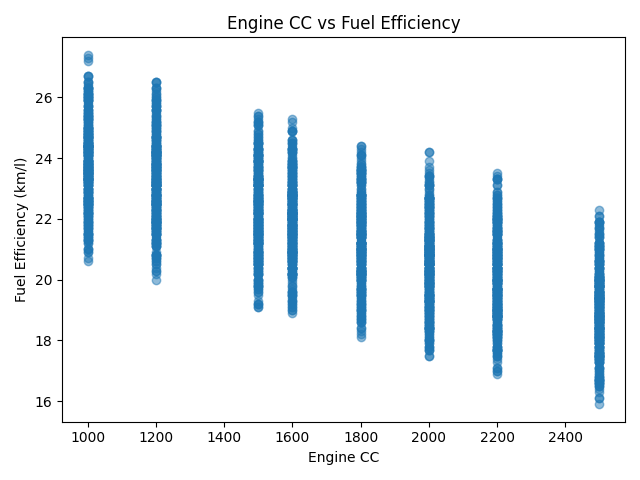

The supplied records show lower fuel efficiency as engine displacement increases. The vertical bands reflect the discrete engine sizes represented in the dataset.

### 7.3 Random Forest Feature Importance

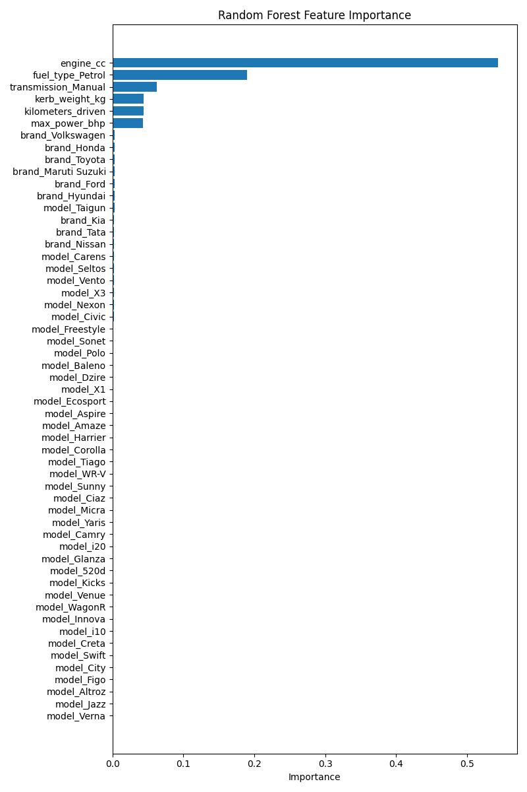

The chart confirms that engine displacement dominates the impurity-based importance values, followed by petrol fuel type.

## 8. Program Workflows

`train_model.py` loads the CSV, trains the model, reports test metrics, saves `efficiency_model.pkl`, and prints an example prediction.

`user_ip.py` trains the model at startup and presents numbered terminal menus for categorical selections followed by four numeric prompts. It can repeat predictions until the user exits.

`graph.py` repeats the training/evaluation process and saves the three PNG files in `graph_visualizations`.

### Interactive Session Sequence

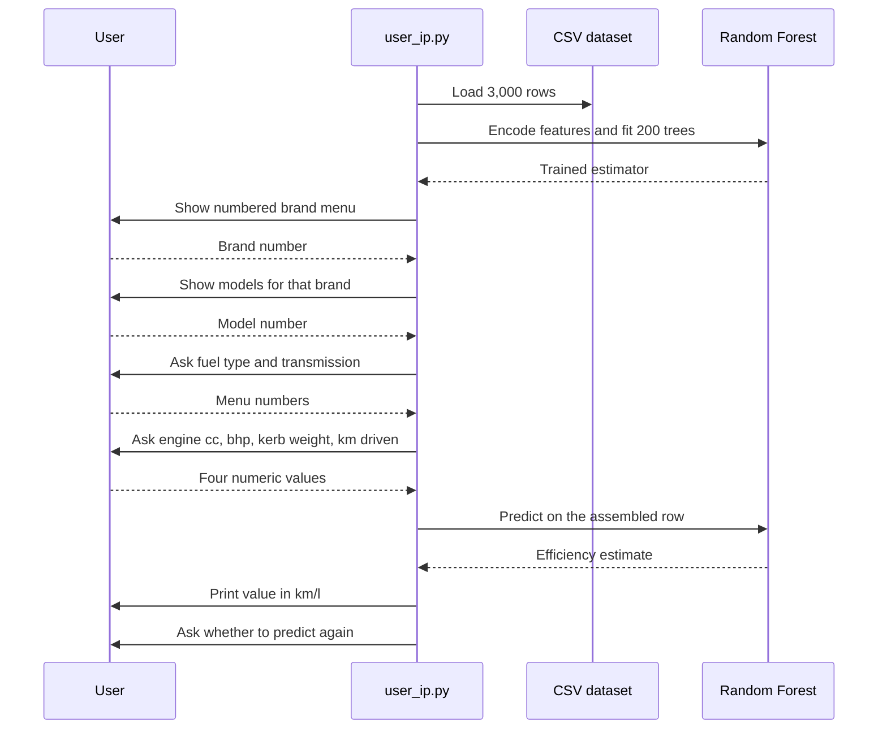

### Interactive Loop States

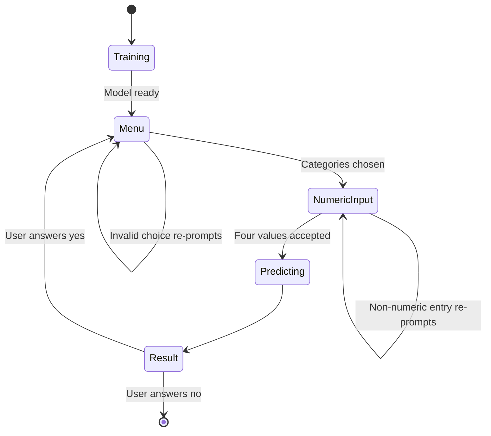

The model is trained once per launch, so repeated predictions in the same
session reuse the same fitted forest.

## 9. Verified Limitation in Single-Row Encoding

The training data is encoded correctly across all dataset categories. The example and interactive prediction paths, however, encode a one-row DataFrame independently with `drop_first=True`. Because each categorical column contains only one observed value in that row, pandas drops that value and produces no categorical dummy columns. Reindexing then fills every training-time category column with zero.

A focused check using identical numeric specifications produced:

| Selection | Nonzero categorical columns | Prediction |
|---|---:|---:|
| BMW 320i, Diesel, Automatic | 0 | 22.259500 km/l |
| Toyota Corolla, Petrol, Manual | 0 | 22.259500 km/l |

Consequently, categorical menu choices do not currently influence single-car predictions. A future correction should fit and save preprocessing with the model, preferably using `ColumnTransformer` and `OneHotEncoder(handle_unknown="ignore")` inside a scikit-learn `Pipeline`.

The difference is that the recommended path reuses an encoder fitted on the
whole dataset, so it already knows every category and does not depend on how
many distinct values appear in the row being predicted.

## 10. Other Limitations

- Dataset provenance is not documented.
- Evaluation uses one train-test split rather than cross-validation.
- Numeric terminal inputs are not restricted to observed ranges.
- The terminal predictor retrains the model on every launch.
- The saved estimator does not include preprocessing or encoded feature names.
- There are no automated tests for data validation or prediction behavior.

## 11. Future Improvements

- Package preprocessing and regression in one saved pipeline.
- Add range validation for numeric terminal inputs.
- Load a compatible saved pipeline instead of retraining at startup.
- Add cross-validation and report uncertainty across folds.
- Add automated tests for encoding, input handling, and reproducibility.
- Record the dataset source, license, and generation or collection method.

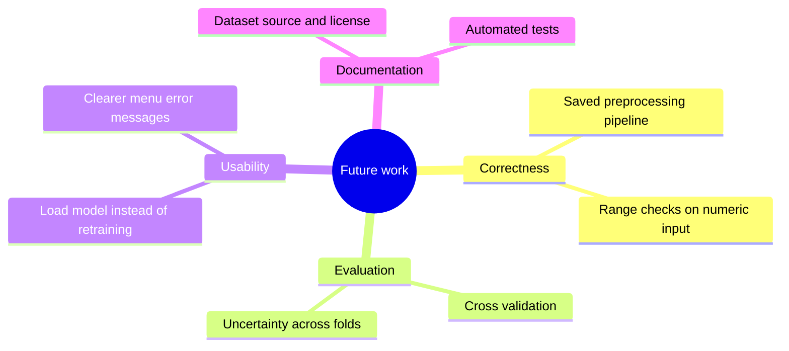

## 12. Conclusion

The project successfully demonstrates a complete introductory regression workflow: data preparation, Random Forest training, held-out evaluation, serialization, command-line interaction, and visual analysis. Its verified test results are MAE 0.851 km/l and R2 0.753. The main issue to address before treating terminal predictions as category-aware is the single-row categorical encoding path described above.
