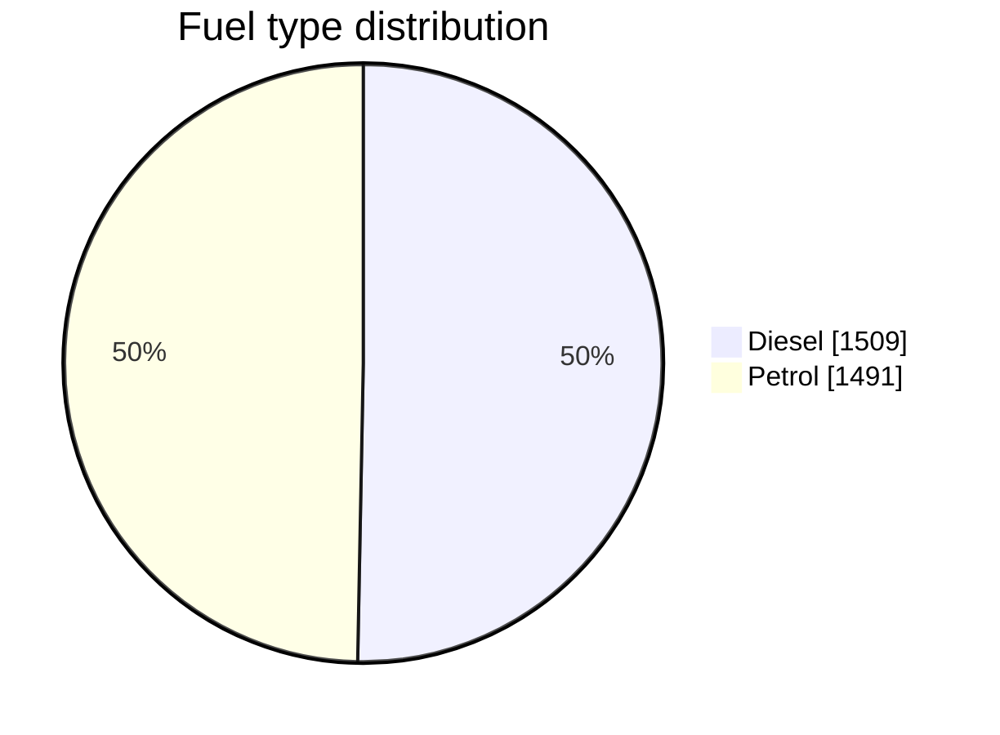
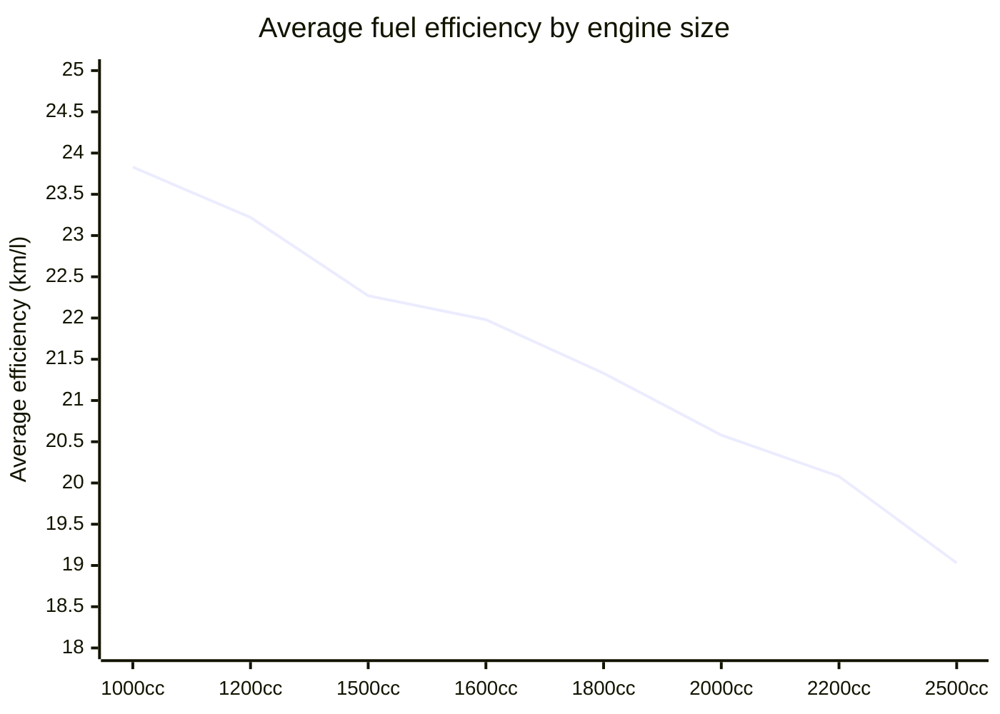
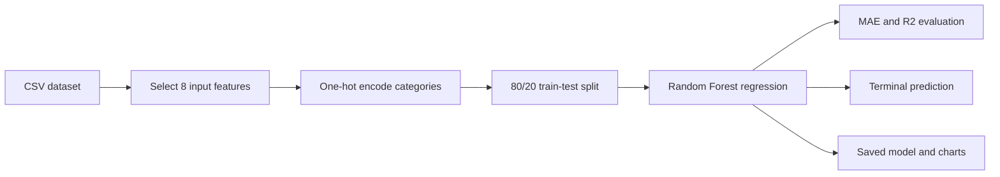
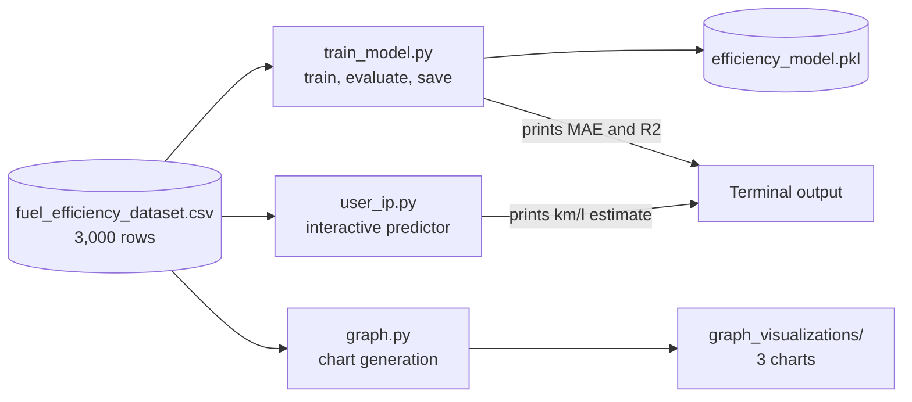
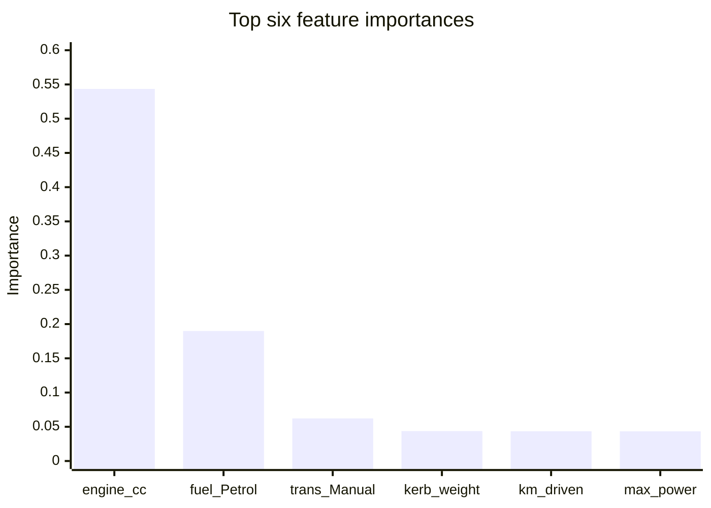
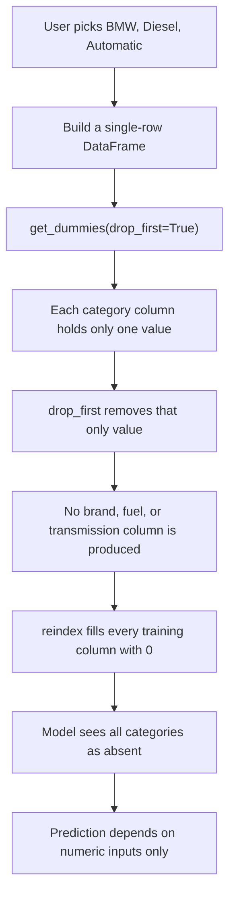

# Fuel Efficiency Prediction

A small machine-learning project that predicts a car's fuel efficiency in kilometres per litre using Random Forest regression. It includes model training, a terminal-based predictor, and three saved evaluation visualizations. No web application or frontend is required.

## Verified Snapshot

| Item | Value |
|---|---:|
| Dataset rows | 3,000 |
| Dataset columns | 9 |
| Input features | 8 |
| Target | `fuel_efficiency_kmpl` |
| Training rows | 2,400 |
| Test rows | 600 |
| Random Forest trees | 200 |
| Test MAE | 0.851 km/l |
| Test R2 | 0.753 |
| Brands | 10 |
| Models | 41 |
| Missing cells | 0 |
| Duplicate rows | 0 |

The values above were reproduced with `test_size=0.2` and `random_state=42`.

## Dataset at a Glance

The two categorical splits are almost perfectly balanced.



Transmission is similarly even, with 1,512 automatic and 1,488 manual records.
The ten brands each contribute between 267 and 338 rows, so no single brand
dominates training.

The clearest relationship in the data is that larger engines return lower
efficiency:



Average efficiency falls steadily from 23.83 km/l at 1,000 cc to 19.03 km/l at
2,500 cc. Diesel cars average 22.37 km/l against 20.64 km/l for petrol, and
manual cars average 22.07 km/l against 20.96 km/l for automatic.

## How It Works



The model uses these inputs:

| Feature | Type | Verified dataset range or values |
|---|---|---|
| `brand` | Categorical | 10 brands |
| `model` | Categorical | 41 models |
| `engine_cc` | Numeric | 1,000 to 2,500 cc |
| `max_power_bhp` | Numeric | 55.3 to 237.5 bhp |
| `kerb_weight_kg` | Numeric | 850 to 1,899 kg |
| `fuel_type` | Categorical | Diesel, Petrol |
| `transmission` | Categorical | Automatic, Manual |
| `kilometers_driven` | Numeric | 508 to 199,976 km |

The target ranges from 15.9 to 27.4 km/l in the supplied dataset.

### Script Responsibilities



Each of the three scripts trains its own model from the CSV. Only `train_model.py`
writes the saved model file.

## Project Structure

```text
.
|-- graph_visualizations/
|   |-- actual_vs_predicted.png
|   |-- enginecc_vs_efficiency.png
|   `-- feature_importance.png
|-- efficiency_model.pkl
|-- fuel_efficiency_dataset.csv
|-- graph.py
|-- train_model.py
|-- user_ip.py
|-- PROJECT_REPORT.md
|-- README.md
`-- requirements.txt
```

## Setup

Python 3.12 is recommended.

```bash
python -m venv .venv
```

Windows PowerShell:

```powershell
.\.venv\Scripts\Activate.ps1
python -m pip install -r requirements.txt
```

macOS or Linux:

```bash
source .venv/bin/activate
python -m pip install -r requirements.txt
```

Keep the terminal inside this project folder because the scripts use relative file paths.

## Run the Project

Train, evaluate, and save the model:

```bash
python train_model.py
```

This writes `efficiency_model.pkl`, prints the test metrics, and predicts one example car.

Run the interactive terminal predictor:

```bash
python user_ip.py
```

Choose a brand, model, fuel type, and transmission from numbered menus, then enter the numeric vehicle details. The script trains the model before accepting predictions.

Regenerate all three charts:

```bash
python graph.py
```

## Verified Results

| Metric | Result |
|---|---:|
| Mean Absolute Error | 0.851 km/l |
| R2 score | 0.753 |
| Included example prediction | 22.26 km/l |

An MAE of 0.851 km/l means predictions differ from test values by about 0.85 km/l on average. An R2 of 0.753 means the model explains about 75.3% of the target variation in this split.

The most important encoded features are:

| Feature | Importance |
|---|---:|
| `engine_cc` | 0.5435 |
| `fuel_type_Petrol` | 0.1899 |
| `transmission_Manual` | 0.0622 |
| `kerb_weight_kg` | 0.0437 |
| `kilometers_driven` | 0.0434 |
| `max_power_bhp` | 0.0433 |



Engine displacement alone accounts for about 54% of the total importance, and
the top three features together account for about 80%.

## Visualizations

### Actual vs Predicted


### Engine Size vs Fuel Efficiency


### Feature Importance


## Known Limitations

- The dataset source and collection method are not included, so the model should be treated as an academic demonstration rather than a real-world fuel economy authority.
- The current single-row prediction code applies `get_dummies(..., drop_first=True)` to one row. This removes all categorical dummy columns, so brand, model, fuel type, and transmission choices do not currently affect terminal/example predictions when numeric inputs are identical.
- The interactive script accepts numeric values outside the dataset range and retrains the model every time it starts.
- The saved model contains the estimator but not a complete preprocessing pipeline or feature schema. Reusing it requires reconstructing the encoded columns from the dataset.
- Feature importance is impurity-based and should not be interpreted as causation.

### Why Categorical Choices Are Ignored



This was confirmed by comparing two very different cars with identical numeric
inputs. Both produced exactly 22.259500 km/l. The report explains the fix in
more detail.

The model file was created with scikit-learn 1.7.1. The requirements pin that version for compatible loading.
